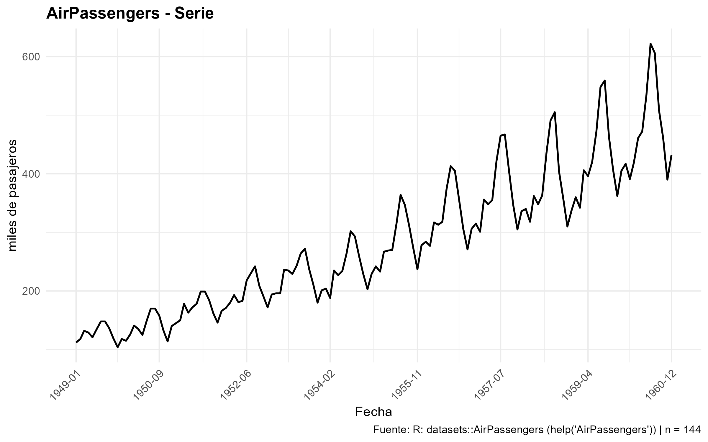
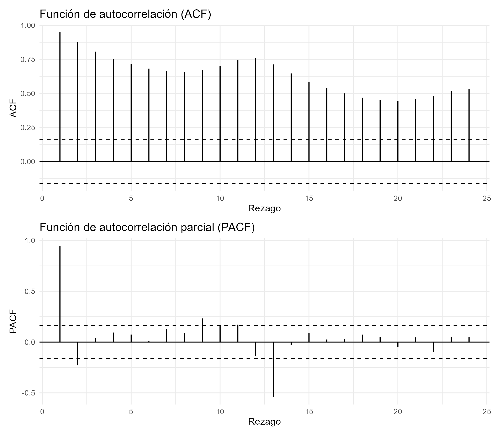
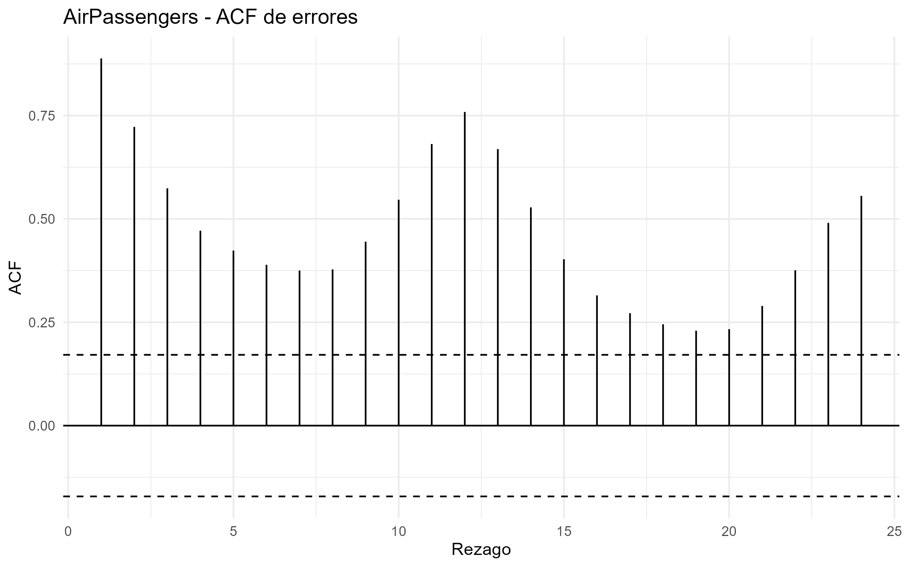
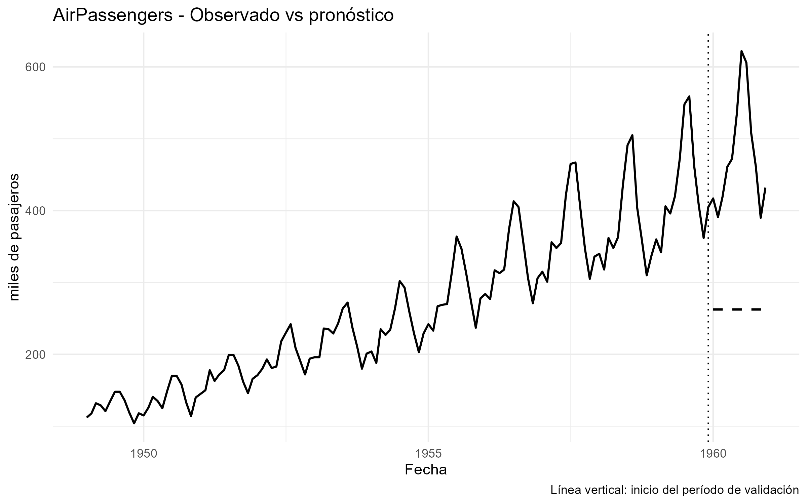

# Introducción

Este informe documenta la ejecución de los ocho métodos de pronóstico implementados manualmente en R. El análisis sigue el protocolo de la tarea: descripción de cada serie, gráfico, correlograma, lectura de los patrones, separación entre estimación y validación, selección de parámetros mediante una rejilla cuando corresponde, medidas de error, validación de residuos y comparación con el pronóstico ingenuo.

Los cálculos se ejecutan a partir de los archivos del repositorio mediante rutas relativas.

```{r}
options(width = 100)

source("R/00-lectura.R")
source("R/01-graficos.R")
source("R/02-metodos.R")
source("R/03-evaluacion.R")

# Ejecuta los ocho ejemplos y guarda las figuras/resultados.
source("ejemplos/ejemplos.R")
```

> **Nota:** la ejecución puede mostrar warnings de `ggplot2` relacionados con la escala de fechas y filas omitidas en algunos gráficos. Estos mensajes no detienen la ejecución; el script debe terminar con `Ejecución finalizada correctamente.`

# Protocolo de análisis

Para cada serie se usa un tramo de estimación y un tramo final de validación. La longitud de validación se calcula como

$$
h=\min\{12,\lfloor 0.2T\rfloor\},
$$

y, para series estacionales, se garantiza al menos un ciclo completo.

Las medidas de error usadas son

$$
MSE=\frac{1}{h}\sum e_t^2,\qquad
MAD=\frac{1}{h}\sum |e_t|,
$$

$$
MAPE=100\frac{1}{h}\sum\left|\frac{e_t}{y_t}\right|,
\qquad
MASE=\frac{MAD}{\text{escala ingenua}}.
$$

La escala del MASE se calcula únicamente sobre el tramo de estimación y corresponde al error absoluto medio del pronóstico ingenuo; en series estacionales se utiliza el ingenuo estacional.

La prueba de Ljung--Box usada en el código es

$$
Q_m=T(T+2)\sum_{h=1}^{m}\frac{r_h^2}{T-h},
$$

que bajo la hipótesis nula se contrasta con una distribución $\chi^2_{m-p}$ para los residuos de un método con $p$ parámetros estimados.

La prueba de Jarque--Bera es

$$
JB=\frac{N}{6}\left[A^2+\frac{(K-3)^2}{4}\right],
$$

con distribución asintótica $\chi^2_2$ bajo normalidad.

El estadístico de Durbin--Watson es

$$
d=\frac{\sum_{t=2}^{N}(e_t-e_{t-1})^2}
        {\sum_{t=1}^{N}e_t^2}.
$$

# Resumen de los ocho ejemplos

```{r}
tabla_resultados
```

La tabla contiene el método, los parámetros seleccionados, las medidas de error en estimación y validación, el MASE del referente ingenuo y los principales diagnósticos de residuos.

# Descripción de las pruebas

En cada prueba se reportan: (1) hipótesis nula y alterna, (2) estadístico, distribución y grados de libertad cuando corresponden, (3) región de rechazo al 5 %, (4) valor observado y valor p, (5) decisión y (6) lectura para la serie o el método.

## Ljung--Box sobre la serie

Se plantea $H_0:r_1=\cdots=r_m=0$ frente a $H_1:$ al menos una autocorrelación es distinta de cero. El estadístico es $Q_m$ y bajo $H_0$ sigue aproximadamente $\chi^2_m$ porque aquí $p=0$. Se rechaza al 5 % si $Q_m>\chi^2_{m,0.95}$, equivalentemente si $p<0.05$.

## Contrastes individuales de autocorrelación

Para cada rezago $h$ se contrasta $H_0:r_h=0$ frente a $H_1:r_h\neq0$. Bajo la aproximación normal se usa $Z_h=r_h\sqrt{T}\sim N(0,1)$, con región de rechazo $|Z_h|>1.96$. El mismo criterio aparece gráficamente mediante la banda $\pm1.96/\sqrt{T}$.

## Media cero de los errores

Se contrasta $H_0:\mu_e=0$ frente a $H_1:\mu_e\neq0$. El estadístico es $t=\bar e/(s_e/\sqrt N)$, con distribución $t_{N-1}$. Se rechaza al 5 % si $|t|>t_{N-1,0.975}$.

## Ljung--Box de los errores

Se contrasta $H_0:r_1=\cdots=r_m=0$ frente a $H_1:$ alguna autocorrelación no es cero. El estadístico es $Q_m$ y se compara con $\chi^2_{m-p}$, donde $p$ es el número de parámetros estimados por el método. Se rechaza si $Q_m>\chi^2_{m-p,0.95}$.

## Jarque--Bera

Se contrasta $H_0:$ los errores tienen asimetría 0 y curtosis 3 frente a la alternativa de no normalidad. El estadístico $JB$ se compara con $\chi^2_2$. Se rechaza si $JB>\chi^2_{2,0.95}$.

## Durbin--Watson

Se usa $d$ para evaluar autocorrelación de primer orden. La referencia es $d\approx2$ cuando no existe autocorrelación de primer orden. La decisión formal se interpreta con las cotas $d_L$ y $d_U$ correspondientes al tamaño muestral y número de regresores; cuando esas cotas no están disponibles en el entorno de ejecución, se reporta el estadístico y su interpretación descriptiva sin inventar valores críticos.

# Análisis individual

```{r, results='asis', echo=TRUE}
fmt <- function(x, d = 4) {
  if (length(x) == 0 || is.null(x) || !is.finite(x)) return("NA")
  formatC(x, format = "f", digits = d)
}

fmt_p <- function(x) {
  if (length(x) == 0 || is.null(x) || !is.finite(x)) return("NA")
  format.pval(x, digits = 4, eps = 1e-4)
}

decision_p <- function(p, alpha = 0.05) {
  if (is.null(p) || !is.finite(p)) return("no evaluable")
  if (p < alpha) "se rechaza H0" else "no se rechaza H0"
}

pref <- c(
  "01_Nile_media",
  "02_nottem_mm",
  "03_LakeHuron_ses",
  "04_WWWusage_dmm",
  "05_airmiles_lineal",
  "06_UKDriverDeaths_cuadratica",
  "07_JohnsonJohnson_exponencial",
  "08_austres_holt"
)

for (i in seq_along(resultados)) {

  x <- resultados[[i]]
  r <- x$resumen
  desc <- x$descripcion
  lb <- x$ljung_box_serie
  vr <- x$validacion_residuos
  comp <- x$comparacion

  cat("\n\n## ", i, ". ", x$nombre, " — ", r$metodo, "\n\n", sep = "")

  cat(
    "**Descripción.** La serie tiene ", desc$n, " observaciones, frecuencia ",
    desc$frecuencia, ", desde ", desc$fecha_inicio, " hasta ", desc$fecha_final,
    ". El tramo de estimación contiene ", desc$observaciones_estimacion,
    " observaciones y el tramo de validación contiene h = ", desc$h_validacion,
    " observaciones.\n\n", sep = ""
  )

  cat("**Justificación del método.** ", desc$justificacion, "\n\n", sep = "")

  cat("\n\n", sep = "")
  cat("\n\n", sep = "")

  cat("### Ljung--Box de la serie\n\n")
  cat(
    "H0: todas las autocorrelaciones hasta m son cero; H1: al menos una es distinta de cero. ",
    "Q = ", fmt(lb$estadistico), ", gl = ", lb$gl,
    ", valor crítico = ", fmt(lb$valor_critico_5),
    " y p = ", fmt_p(lb$p_valor), ". ",
    decision_p(lb$p_valor), " al 5 %. ",
    ifelse(lb$p_valor < 0.05,
      "Existe evidencia de dependencia serial en la serie.",
      "No se detecta evidencia suficiente de dependencia serial conjunta hasta el rezago evaluado."
    ),
    "\n\n", sep = ""
  )

  cat("### Autocorrelaciones individuales\n\n")
  sig <- x$acf_serie[x$acf_serie$significativo, ]
  if (nrow(sig) == 0) {
    cat("Ningún rezago evaluado supera la banda de ruido blanco.\n\n")
  } else {
    cat("Los rezagos que superan la banda son: ",
        paste(sig$lag, collapse = ", "), ".\n\n", sep = "")
  }

  cat("### Ajuste, parámetros y optimización\n\n")
  cat("Parámetros seleccionados: **", r$parametro, "**.\n\n", sep = "")

  if (!is.null(x$optimizacion)) {
    cat("La constante o ventana se obtuvo mediante la rejilla exigida, minimizando el MSE de un paso en el tramo de estimación.\n\n")
    opt_file <- if (i == 2) "02_nottem_mm_optimizacion.png"
      else if (i == 3) "03_LakeHuron_ses_optimizacion.png"
      else if (i == 4) "04_WWWusage_dmm_optimizacion.png"
      else if (i == 8) "08_austres_holt_optimizacion.png"
      else NA_character_
    if (!is.na(opt_file)) cat("\n\n", sep = "")
  }

  if (r$metodo %in% c("lineal", "cuadratica", "exponencial")) {
    cat("La tendencia se estimó mediante las ecuaciones normales. La tabla siguiente contiene los coeficientes y los errores estándar ordinarios y HAC de Bartlett.\n\n")
    print(x$ajuste$parametros$coeficientes)
    cat("\n\n")
    cat("R2 = ", fmt(x$ajuste$parametros$R2),
        "; sigma² = ", fmt(x$ajuste$parametros$sigma2),
        "; Durbin--Watson = ", fmt(x$ajuste$parametros$DW), ".\n\n", sep = "")
  }

  cat("### Medidas de error\n\n")
  cat(
    "| Tramo | MSE | MAD | MAPE | MASE |\n|---|---:|---:|---:|---:|\n",
    "| Estimación | ", fmt(r$MSE_estimacion), " | ", fmt(r$MAD_estimacion),
    " | ", fmt(r$MAPE_estimacion), " | ", fmt(r$MASE_estimacion), " |\n",
    "| Validación | ", fmt(r$MSE_validacion), " | ", fmt(r$MAD_validacion),
    " | ", fmt(r$MAPE_validacion), " | ", fmt(r$MASE_validacion), " |\n\n", sep = ""
  )

  cat("El referente utilizado fue **", comp$referencia,
      "**, cuyo MASE en validación fue ", fmt(r$MASE_ingenuo), ".\n\n", sep = "")

  cat("### Validación de errores\n\n")
  cat(
    "Se analizaron N = ", vr$T, " errores de un paso y se usaron m = ",
    vr$m, " rezagos, con p = ", vr$p, " parámetros para corregir los grados de libertad.\n\n",
    sep = ""
  )

  cat("\n\n", sep = "")
  cat("\n\n", sep = "")

  media <- vr$media
  lb_e <- vr$ljung_box
  jb <- vr$jarque_bera
  dw <- vr$durbin_watson

  cat(
    "**Prueba t de media cero.** H0: μe = 0; H1: μe ≠ 0. ",
    "t = ", fmt(media$estadistico), ", gl = ", media$gl,
    "; crítico = ", fmt(media$valor_critico_5),
    "; p = ", fmt_p(media$p_valor), "; ",
    decision_p(media$p_valor), ". ",
    ifelse(media$p_valor < 0.05,
      "La media de los errores difiere de cero de manera estadísticamente detectable.",
      "No se detecta evidencia suficiente de que la media de los errores difiera de cero."
    ), "\n\n", sep = ""
  )

  cat(
    "**Ljung--Box de errores.** H0: r1 = ... = rm = 0; H1: alguna autocorrelación no es cero. ",
    "Q = ", fmt(lb_e$estadistico), ", gl = ", lb_e$gl,
    ", crítico = ", fmt(lb_e$valor_critico_5),
    ", p = ", fmt_p(lb_e$p_valor), "; ",
    decision_p(lb_e$p_valor), ". ",
    ifelse(lb_e$p_valor < 0.05,
      "Queda evidencia de autocorrelación remanente en los errores.",
      "No se detecta evidencia suficiente de autocorrelación conjunta remanente."
    ), "\n\n", sep = ""
  )

  cat(
    "**Jarque--Bera.** H0: asimetría = 0 y curtosis = 3; H1: al menos una condición falla. ",
    "JB = ", fmt(jb$estadistico), ", gl = 2, crítico = ", fmt(jb$valor_critico_5),
    ", p = ", fmt_p(jb$p_valor), "; ", decision_p(jb$p_valor), ". ",
    ifelse(jb$p_valor < 0.05,
      "La normalidad no queda respaldada por esta prueba.",
      "No se detecta evidencia suficiente contra la normalidad mediante JB."
    ),
    ifelse(vr$T < 20,
      " La interpretación es asintótica y debe tomarse con cautela porque N < 20.",
      ""
    ), "\n\n", sep = ""
  )

  cat(
    "**Durbin--Watson.** H0: ausencia de autocorrelación de primer orden; H1: presencia de autocorrelación de primer orden. ",
    "d = ", fmt(dw),
    ". La decisión formal requiere las cotas dL y dU de las tablas correspondientes; no se inventan valores críticos. ",
    "Descriptivamente, un valor cercano a 2 es compatible con poca autocorrelación de primer orden.\n\n",
    sep = ""
  )

  cat("### Comparación con el referente y cierre\n\n")
  cat(
    "**Conclusión.** El método ", r$metodo, " con parámetros ", r$parametro,
    " produjo MASE = ", fmt(r$MASE_validacion),
    " en validación, frente a MASE = ", fmt(r$MASE_ingenuo),
    " del ", comp$referencia, ". La validación de residuos produjo p de Ljung--Box = ",
    fmt_p(r$LB_p), ", p de Jarque--Bera = ", fmt_p(r$JB_p),
    " y Durbin--Watson = ", fmt(r$DW), ".\n\n", sep = ""
  )

  cat(
    "**Recomendación.** El pronóstico se evalúa para el horizonte de ", desc$h_validacion,
    " periodos usado en la validación. El límite principal se evidencia mediante el MASE frente al referente y la posible autocorrelación remanente de los errores.\n\n",
    sep = ""
  )

  cat("\n\n", sep = "")
}
```

# Contraejemplo

El contraejemplo deliberado utiliza `AirPassengers` con la media histórica. La justificación del ejercicio es que la serie presenta una estructura estacional fuerte y crecimiento, mientras que la media histórica no representa explícitamente esos componentes.

```{r}
contraejemplo$descripcion
contraejemplo$resumen
contraejemplo$acf_serie
contraejemplo$validacion_residuos$ljung_box
```

La evidencia de fallo se interpreta conjuntamente mediante el patrón de la serie, el MASE de validación y la autocorrelación remanente de los errores.









# Verificaciones de implementación

La ejecución incluye la verificación de la ACF manual frente a `acf(plot = FALSE)`. La diferencia máxima debe ser menor que $10^{-12}$.

```{r}
cat("Diferencia máxima ACF:", diferencia_acf, "\n")
cat("Coincide:", diferencia_acf < 1e-12, "\n")
```

# Conclusiones generales

Los ocho ejemplos cubren, en el orden exigido, media histórica, media móvil, suavizamiento exponencial simple, doble media móvil, tendencia lineal, tendencia cuadrática, tendencia exponencial y Holt lineal. La comparación de MASE en el tramo de validación permite valorar cada ajuste frente a su referente ingenuo correspondiente.

La elección de las constantes o ventanas se realiza mediante la rejilla definida en la tarea. Las pruebas sobre los errores permiten revisar la media cero, la autocorrelación, la normalidad y la autocorrelación de primer orden.

# Reproducibilidad

Desde la raíz del repositorio:

```r
source("ejemplos/ejemplos.R")
```

El informe utiliza las mismas funciones, datos, parámetros y figuras generadas por `ejemplos.R`.
